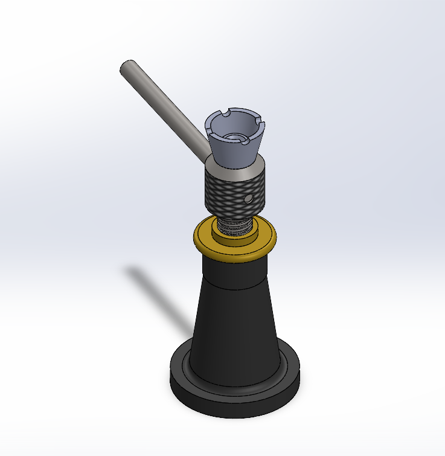

# Screw Jack — CAD Practice

A SolidWorks model of a screw jack (mechanical lifting device), built as independent CAD practice rather than for a course case study.

`SolidWorks` `CAD` `Mechanical Design`

---

## What's in this repo

- **`screw-jack.SLDASM`** — the full assembly.
- **`01_Body.SLDPRT`** through **`07_Hex-Socket-Head-Screw-ISO.SLDPRT`** — individual part files: body, nut, screw spindle, tommy bar, cup, special washer, and hex socket head screws.
- **`screw-jack-assembly-animation.avi`** — a rendered animation of the assembly.
- **`renders/`** — reference renders: a cross-section view showing the thread engagement between the screw spindle and nut, an isometric view of the finished assembly, and an early detail study of the thread profile.

## About the design

A screw jack converts rotary motion (turning the tommy bar) into linear motion (raising the cup) via a threaded screw spindle running through a fixed nut — a classic mechanical-advantage exercise for practicing threaded-fastener modeling, assembly mating, and section-view analysis in CAD. The cross-section render shows the thread engagement and how the load path runs from the cup down through the spindle, nut, and body to the base.

## License / Use

Personal practice project, not part of any course. Shared here for portfolio purposes.
